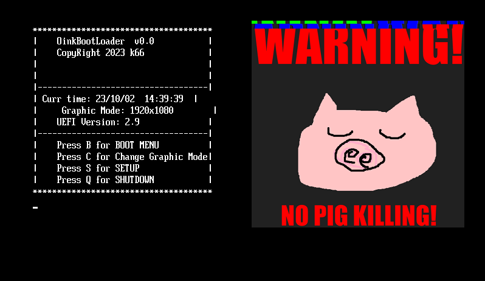
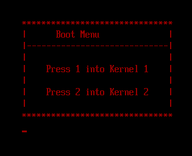
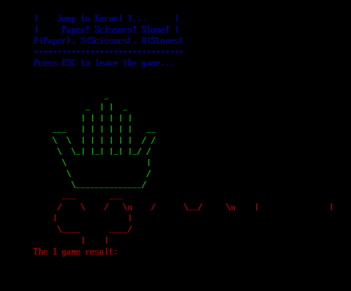

系列文[世界第一簡單的UEFI，實作打造自己的開機畫面](https://ithelp.ithome.com.tw/users/20161828/ironman/6446?page=1)

# Oink Bootloader (OinkBL)

  

## Windows 10上執行

+ 需安裝7個工具(手把手教學文[系列文Day6](https://ithelp.ithome.com.tw/articles/10317238))
    1. [Visual Studio 2019(Edk2 C compiler for Windows)](https://my.visualstudio.com/Downloads?Pid=8228)，勾選C++開發工具。
    2. [EDK2](https://github.com/tianocore/edk2/releases/tag/edk2-stable202208)，裝好後放C:\edk2space。
    3. [Python](https://www.python.org/downloads/release/python-3115/)
    4. [NASM](https://www.nasm.us/pub/nasm/releasebuilds/?C=M;O=D)，裝好後放C:\NASM。
    5. [ASL](https://www.intel.com/content/www/us/en/download/774881/acpi-component-architecture-downloads-windows-binary-tools.html)，裝好後放C:\ASL。
    6. [QEMU](https://qemu.weilnetz.de/w64/)，裝好後放C:\QEMU，並在C:\QEMU\建立一個空資料夾Test。
    7. OVMF：EDK2編譯後就會產生`ovmf.fd`，將`ovmf.fd`放至`C:\QEMU\Test`。

+ 設定(手把手教學文[系列文Day7](https://ithelp.ithome.com.tw/articles/10317443))

## 完整OinkBL
- [Full-OinkBL](OinkBLPkg)
  - Full OinkBL folder

## 鐵人賽文章對應資料夾

- [Day3-Asm-Bootloader](d03-asm-bootloader)
  - x86 assembly bootloader
- [Day8-UefiMain](d08-uefiMain)
  - First UEFI Application
- [Day10-main](d10-main)
  - Second UEFI Application, include <stdio.h>
- [Day13-RedRectangle](d14-redRectangle)
  - Draw a red rectabgle
- [Day16-DrawLogo](d16-drawLogo)
  - Draw a Logo, first time
- [Day17-DrawLogo2](d17-drawLogo2)
  - Draw a Logo, second time
- [Day18-ShowTime](d18-showtime)
  - Display system time
- [Day19-Esc](d19-esc)
  - Escape by ESC
- [Day21-Kernel](d21-kernel)
  - Write a kernel
- [Day23-BootMenu](d23-bootmenu)
  - Write a boot menu
- [Day26-SetMonitorMode](d26-setMonitorMode)
  - Set monitor mode
- [Day27-WriteGame](d27-writeGame)
  - Write a paper sissor stone game

## 版權聲明(Licensing)

`OinkBL` is freely redistributable under the two-clause BSD License.
Use of this source code is governed by a BSD-style license that can be found
in the `LICENSE` file.

## Reference

- [Assembly](https://zh.wikipedia.org/zh-tw/%E6%B1%87%E7%BC%96%E8%AF%AD%E8%A8%80)
- [Bootloader](https://zh.wikipedia.org/zh-tw/%E5%95%9F%E5%8B%95%E7%A8%8B%E5%BC%8F)
- [Kernel](https://zh.wikipedia.org/wiki/%E5%86%85%E6%A0%B8)
- [UEFI](https://zh.wikipedia.org/zh-tw/%E7%B5%B1%E4%B8%80%E5%8F%AF%E5%BB%B6%E4%BC%B8%E9%9F%8C%E9%AB%94)
- [EDK2](https://github.com/tianocore/edk2)
- [NASM](https://zh.wikipedia.org/zh-tw/Netwide_Assembler)
- [QEMU](https://zh.wikipedia.org/zh-tw/QEMU)
- [OVMF](https://github.com/tianocore/tianocore.github.io/wiki/OVMF)
